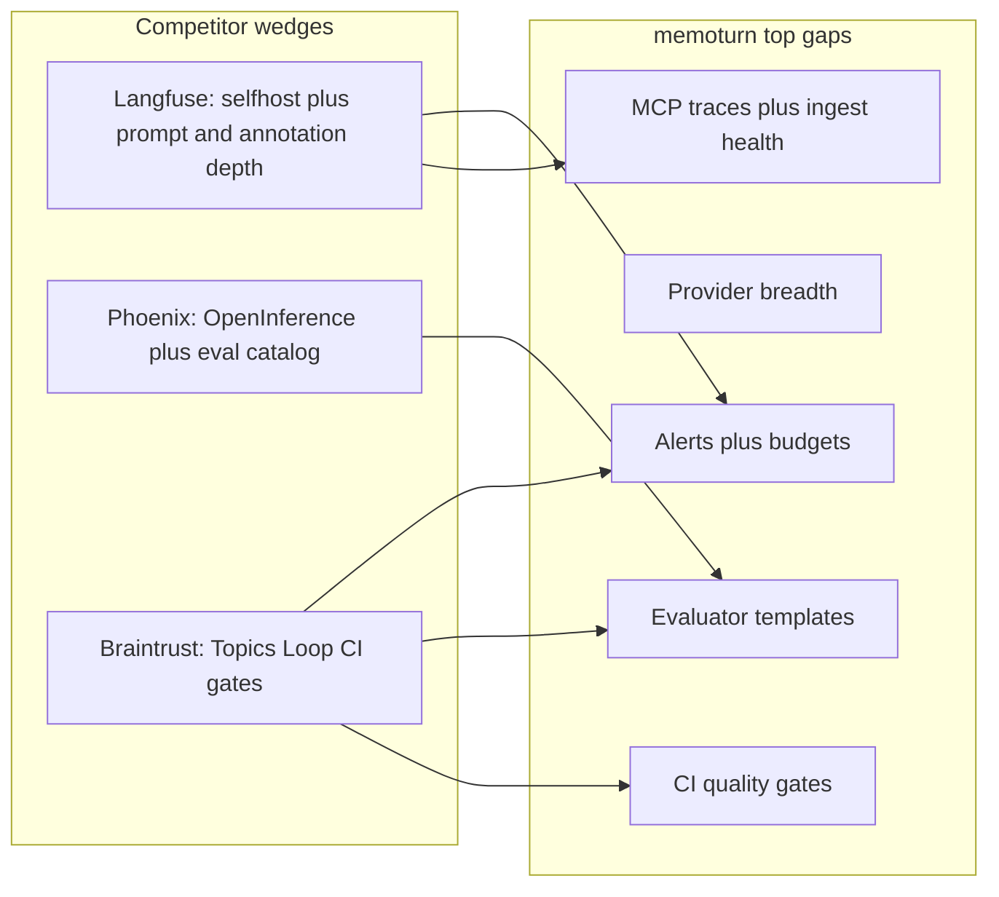
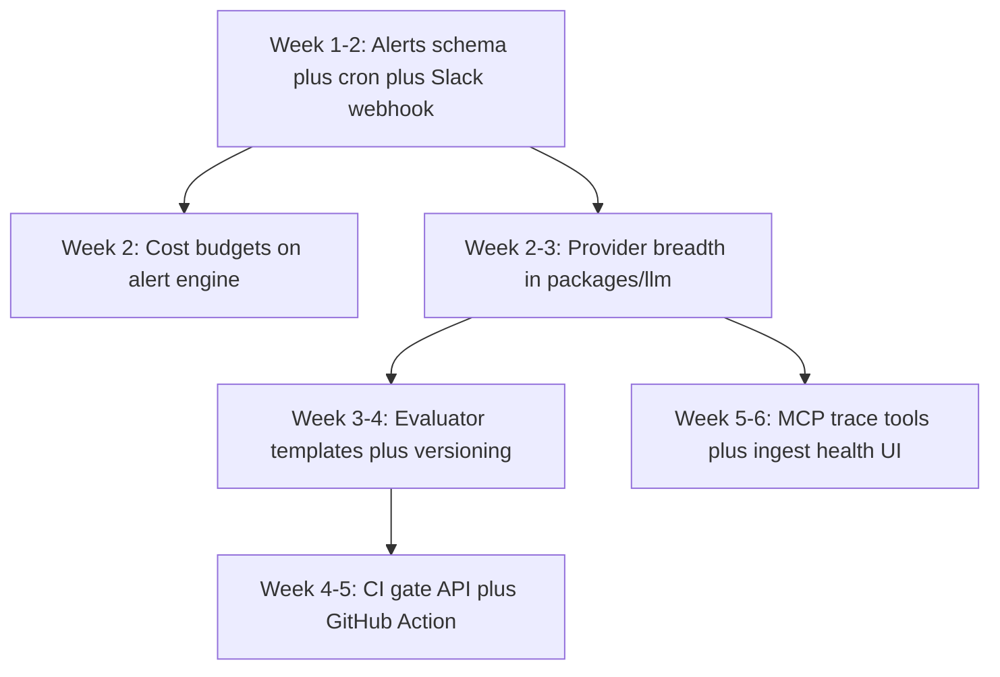

# Competitive gap analysis and implementation plan

## Positioning snapshot

| | memoturn | [Langfuse](https://github.com/langfuse/langfuse) | [Phoenix](https://github.com/arize-ai/phoenix) | [Braintrust](https://www.braintrust.dev/) |
|---|---|---|---|---|
| Wedge | Self-hostable AI eng platform; blob-first ingest trust; MCP-native | OSS full LLM loop (trace→prompt→eval); ClickHouse-backed | OTel/OpenInference + notebook eval science | Eval-first quality loop (Topics, Loop, CI gates) |
| License / deploy | Apache-2.0, self-host first | MIT (+ EE); Cloud + self-host parity | ELv2; Phoenix OSS → upsell to Arize AX | Proprietary SaaS; Enterprise hybrid data plane |
| Store | Postgres + **Doris** + blob + Redis | Postgres + ClickHouse + blob | SQLite/Postgres (AX = adb) | **Brainstore** (proprietary) |

memoturn already ships a broad parity surface (traces/sessions/users, online+offline evals, review queues, prompts/channels, playground, SSO/SAML, webhooks/automations, masking, retention, MCP for prompts/datasets/review). The competitive losses are concentrated in **production ops**, **eval time-to-value**, **CI gating**, and **productizing differentiators** — not in core tracing.

---

## Competitor deep dives

### Langfuse — OSS full-lifecycle platform

**Strengths vs memoturn:** integration density (LiteLLM, LlamaIndex, Vercel AI, no-code builders); prompt composability + client/server cache; observation-targeted online judges with a built-in evaluator library; custom dashboards with JSON import/export; session publish links; Cloud spend/usage alerts; agent-graph polish.

**Where memoturn already matches or leads:** sessions/users, review queues + assignments, online LLM-as-judge with sampling, prompt channels/labels, SAML (Langfuse is OIDC-only), audit log in OSS, blob-first ingest + DLQ (CLI), MCP for prompts/datasets/review, Apache-2.0 vs EE gating of compliance features.

**Gaps that lose head-to-heads:** no stateful **alert rules**; thinner **dashboard flexibility**; no **evaluator template library**; weaker framework adapter surface; agent-graph claimed shipped but only waterfall depth today.

### Phoenix / Arize — standards + eval science

**Strengths vs memoturn:** OpenInference ownership + widest auto-instrumentation; pre-built RAG/agent judge catalog (Faithfulness, Doc Relevance, Tool Selection/Invocation); notebook-local DX; span replay into playground; PXI in-product assistant.

**Where memoturn leads:** production online evals in OSS (Phoenix online evals are **AX-only**); org SSO/SAML + RBAC; review queues; prompt channels; cost/metrics dashboards; webhooks/automations; MIT-friendly Apache-2.0.

**Gaps that matter:** no **prebuilt eval catalog** (biggest eval adoption friction); no OpenInference-first story (OTel GenAI ingest exists — lean on that, don’t rebuild OpenInference); embedding/UMAP is a fading Phoenix differentiator — skip.

### Braintrust — eval-first quality platform

**Strengths vs memoturn:** **Topics** + custom facets (unsupervised pattern discovery); **Loop** agent (NL → filters/datasets/scorers); **immutable experiments + `eval-action` CI gates**; Autoevals library; Brainstore FTS/scale narrative; multi-lang SDKs beyond Py/TS; hybrid Enterprise.

**Where memoturn leads / holds:** fully self-hostable open stack (Braintrust control plane stays SaaS); online evaluators + review queues already shipped; cost/token metrics without Pro plan cliffs; Doris as customer-owned analytics engine.

**Gaps that lose deals with eval-mature teams:** no **CI quality gate** product; no Autoevals-class **templates**; no Topics/Loop (defer — XL research + LLM pipeline); no polished one-click **trace→dataset→experiment** narrative beyond batch add-to-dataset.

---

## Value-ranked gap matrix (what to build vs defer)

| Rank | Gap | Loses to | Value | Effort | Decision |
|---|---|---|---|---|---|
| 1 | Alert rules + cost budgets | All three | Blocks “production ready” evals | L+M | **Build now** |
| 2 | Provider breadth (Gemini/Bedrock/Azure/OpenAI-compat) | Langfuse, Phoenix playground | Unlocks playground, judges, replay | M | **Build now** |
| 3 | Evaluator template library + versioning | Phoenix catalog, Braintrust Autoevals | Cuts time-to-first-eval | M | **Build now** |
| 4 | CI quality gates (`eval-action` + threshold API) | Braintrust | Unlocks eng release workflow | M | **Build now** |
| 5 | MCP trace/metrics tools + ingest health UI | Differentiator vs all | Turns architecture into demo | M+M | **Build now** |
| — | Topics / Loop-class AI | Braintrust | High, but XL | XL | **Defer** (post-launch research) |
| — | OpenInference fork | Phoenix | Low (OTel GenAI path exists) | L | **Defer** |
| — | Dashboard v2 / Prompt A/B / SCIM | Langfuse enterprise | Important but secondary | L | Horizon after top 5 |

---

## Implementation plan — top 5

### 1. Alert rules engine + cost budgets

**Why:** Explicit weakest area vs every competitor; already #1 in [docs/roadmap.md](docs/roadmap.md).

**Approach:** Extend event-fire automations into **stateful, cron-evaluated alerts** — do not overload `Automation` rows.

- **Schema** ([packages/db/prisma/schema.prisma](packages/db/prisma/schema.prisma)): new `AlertRule` (projectId, name, metric, window, threshold, comparator, channels JSON, enabled) + `AlertState` (ruleId, status `ok|firing|resolved`, lastFiredAt, lastResolvedAt, lastValue). New `CostBudget` (projectId, monthlyUsd, thresholds `[0.5,0.8,1.0]`).
- **Worker cron** (reuse `withLock` pattern from retention): every ~1–5 min evaluate rules via existing telemetry aggregations in [packages/server/src/metrics.ts](packages/server/src/metrics.ts) / Doris store — metrics: `error_rate`, `latency_p95`, `cost_per_day`, `ingest_volume`, `dlq_depth`. Cost budgets read month-to-date cost rollup.
- **Channels:** reuse Slack/webhook dispatch from [packages/server/src/automations.ts](packages/server/src/automations.ts); add email + PagerDuty action types.
- **API + console:** Settings → Alerts / Budgets; firing/resolved history; soft `overBudget` flag on dashboard (no hard gateway caps).
- **Contracts:** follow add-endpoint skill (contracts → server → `apps/api` → console `api.ts`).

### 2. Provider breadth in `packages/llm`

**Why:** One gateway change improves playground, LLM judges, and trace replay.

- Extend `Provider` in [packages/llm/src/gateway.ts](packages/llm/src/gateway.ts): `gemini` (`@ai-sdk/google`), `bedrock` (`@ai-sdk/amazon-bedrock`), `azure` (OpenAI Azure), `openai_compatible` (baseURL + apiKey for vLLM/Ollama/OpenRouter).
- Wire provider CRUD / secrets already in [packages/server/src/providers.ts](packages/server/src/providers.ts) + Settings UI.
- Update playground, evaluator run path, and replay to accept new provider ids; seed model pricing patterns in [packages/core/src/models.ts](packages/core/src/models.ts) for cost accuracy.

### 3. Evaluator template library + versioning

**Why:** Phoenix/Braintrust win “first eval in 10 minutes”; memoturn forces blank-prompt judge authoring.

- Add built-in templates in `packages/server` (or `packages/core`): hallucination, relevance, toxicity, faithfulness, tool-selection — each with judge prompt + `outputSchema` + suggested score config.
- API: `GET /v1/evaluators/templates`, `POST /v1/evaluators` with `templateId` to instantiate.
- **Versioning:** add `version` (int) + immutable version history on `Evaluator` (or `EvaluatorVersion` table) so online score drift is attributable; UI shows version on score analytics.
- Console Evaluators page: template picker → create → enable online sampling (existing fields).

### 4. CI quality gates

**Why:** Braintrust’s release-blocking wedge; memoturn already has datasets + experiment comparison ([packages/server/src/datasets.ts](packages/server/src/datasets.ts)).

- **API:** `POST /v1/datasets/{name}/runs/{runId}/gate` (or gate query params on comparison) accepting threshold map `{ scoreName: { min?: number, max?: number } }` → `{ passed, failures[] }` suitable for CI exit codes.
- **GitHub Action** under `integrations/github-actions/eval-gate` (or `sdks/` sibling): auth with API keys, trigger/wait for run (or consume existing run id), call gate endpoint, post PR comment summary, fail job on regression.
- **Docs:** short CI cookbook in `docs/` + sync via docs coupling map.
- Python SDK: add minimal dataset/run helpers to match JS (unblocks CI from Python agents).

### 5. MCP trace tools + ingest health console

**Why:** Converts two architectural strengths into visible product demos vs Langfuse/Braintrust MCP and vs opaque ingest.

**MCP** ([packages/server/src/mcp-tools.ts](packages/server/src/mcp-tools.ts)):
- Read: `query_traces`, `get_trace`, `get_metrics`, `list_scores`
- Write: `run_evaluator` (reuse existing evaluator run; RBAC already separates read/write)

**Ingest health** (console + thin API wrapping worker metrics):
- Page under Settings or `/ops`: DLQ depth, insert latency, error counters (already on worker `/metrics`), one-click replay (wrap `bun run dlq --replay`), recent failed batch list.
- API: `GET /v1/ingest/health`, `POST /v1/ingest/dlq/replay` (OWNER/ADMIN only).

---

## Delivery sequence

Ship order: **1a alerts → 1b budgets → 2 providers → 3 templates → 4 CI gates → 5 MCP + ingest health**. Providers can parallelize with alert UI polish; templates benefit from broader providers for real judges.

---

## Explicitly out of scope (this plan)

- Braintrust Topics / Loop (research spike later; needs clustering + LLM summarization pipeline)
- Phoenix UMAP / embedding drift
- Dashboard widget builder v2, Prompt A/B, SCIM / project RBAC / `/ee` (keep on existing Horizon 2–3 roadmap)
- Runtime guardrails / gateway hard caps
- **[Open Responses](https://www.openresponses.org/) as a first-class product surface** — see decision below

### Decision: do we need Open Responses?

**No — not for this roadmap, and not as a competitive must-have.**

[Open Responses](https://www.openresponses.org/) is a **multi-provider LLM call API** (request/response schema, semantic streaming events, agentic tool loop) inspired by OpenAI’s Responses API. It is aimed at **gateways, SDKs, and model hosts** (OpenRouter, vLLM, Ollama, etc.), not at observability platforms.

| Role | Needs Open Responses? |
|---|---|
| memoturn as **observability/eval platform** | No. Customers instrument apps via native ingest / OTel GenAI; traces already capture tool calls and generations regardless of which call API produced them. |
| memoturn as **LLM gateway** (Braintrust-style) | Only if we pivot to gateway product. Roadmap explicitly avoids hard gateway caps; `packages/llm` is playground + judges only. |
| Competitors | Langfuse added a narrow `useResponsesApi` toggle for **LLM connections** (how *they* call OpenAI for playground/judges) — not Open Responses compliance. Phoenix/Braintrust do not treat Open Responses as an ingest standard. |

**What *is* adjacent and worth a later improvement (not this plan):**

1. **SDK wrap for OpenAI `responses.create`** — today’s `wrapOpenAI` only hooks `chat.completions` ([sdks/js/src/openai.ts](sdks/js/src/openai.ts)). Teams on the Responses API get silent gaps; fixing that is instrumentation coverage, not Open Responses support.
2. Optional `packages/llm` client path that can call OpenAI via Responses when useful for playground/judges (Langfuse-style) — fold into provider-breadth polish if OpenAI Responses becomes the default for tool-calling models.

**Do not:** implement an Open Responses-compatible `/v1/responses` server, run their acceptance suite, or reposition memoturn as a Responses-compatible multi-provider router.

#### Structured ingest for Responses request/response data?

**No new ingest event type / wire schema.** Worry about **capture + normalization**, not a parallel Open Responses ingest protocol.

| Layer | Status | Action |
|---|---|---|
| **Wire contract** ([packages/core/src/events.ts](packages/core/src/events.ts)) | Generations already take free-form JSON `input` / `output` (≤1 MB) plus nested spans via `parentObservationId`. Responses `input` / `output.items` (messages, function calls, reasoning, tool results) fit as opaque JSON today. | **Do not** add `response-create` or Open Responses–typed fields to the ingest union. That couples the platform to an evolving multi-vendor call API. |
| **OTel ingest** ([packages/server/src/otel.ts](packages/server/src/otel.ts)) | Maps `gen_ai.input.messages` / `gen_ai.output.messages` (and usage/model) into generations. Frameworks that emit GenAI semconv for Responses-style calls already land. | Keep leaning on OTel GenAI; no Open Responses-specific OTLP mapper. |
| **First-party SDK** | `wrapOpenAI` only records `chat.completions` — Responses users get **no** generations. | Later: wrap `responses.create`, store request input as generation `input`, final `output` / `output.items` as `output`, usage mapped to existing token fields; optional child spans for tool rounds. |
| **UI / evals** | Trace detail renders input/output as JSON; judges consume those blobs. Item-level tool loops are less pretty than chat messages, but scores/datasets still work. | Later polish: detect Responses-shaped payloads and pretty-print items / tool calls (same as better agent-graph UX) — presentation, not ingest. |

**Rule of thumb:** if the customer can get the payload into a generation’s `input`/`output` (SDK wrap, OTel, or manual), memoturn already stores and queries it. The competitive risk is **missing instrumentation**, not missing a structured Responses ingest schema. Competitors (Langfuse/Braintrust/Phoenix) likewise store call payloads as generation/span JSON rather than adopting Open Responses as an ingest standard.

---

## Success criteria

- Production buyer: configure an error-rate or cost-budget alert and receive Slack/webhook on breach + resolve.
- Eval buyer: create a Faithfulness (or similar) judge from a template and enable online sampling in &lt;5 minutes.
- Eng buyer: GitHub Action fails a PR when experiment scores regress past thresholds.
- Differentiator demo: IDE agent queries traces via MCP; console shows DLQ depth and replays a failed batch.
- No regression: online eval failures still never fail ingest; `denyIfReadOnly` on all new mutations; contracts typecheck end-to-end.
