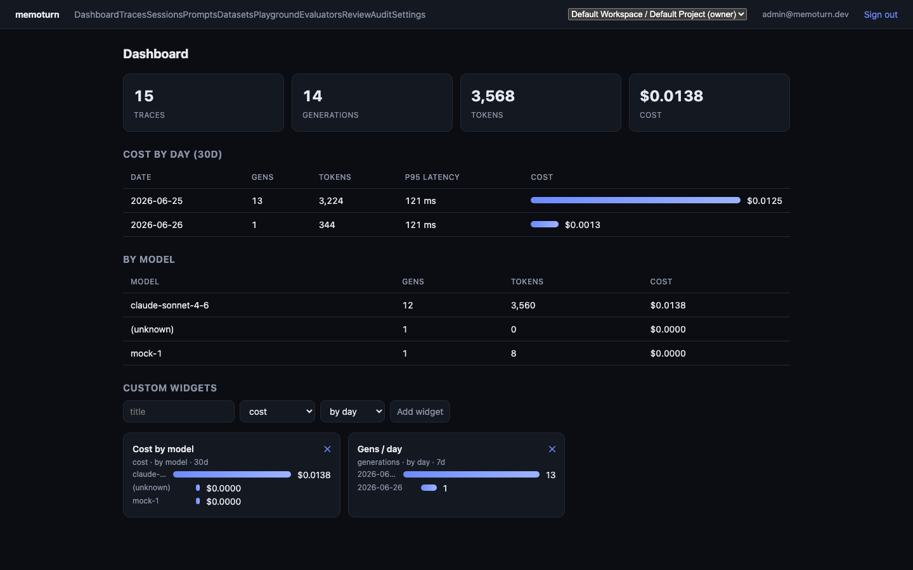

# Memoturn

[](https://github.com/memoturn/memoturn/actions/workflows/ci.yml)
[](./LICENSE)
[](https://www.npmjs.com/package/@memoturn/sdk)
[](https://pypi.org/project/memoturn/)

Open-source **AI engineering platform** — LLM observability, evals, metrics, prompt
management, playground, and datasets. Self-hostable, OpenTelemetry-native, Bun-native.

**[Live demo](https://demo.memoturn.com/demo?utm_source=github&utm_medium=readme)** · **[memoturn.com](https://memoturn.com/?utm_source=github&utm_medium=readme)** · **[docs.memoturn.com](https://docs.memoturn.com/?utm_source=github&utm_medium=readme)** · **[Documentation (in-repo)](./docs/README.md)** — getting started, architecture, API, SDKs, integrations, evaluation, deployment.



## Features

- **Observability** — traces, spans, generations, scores; a waterfall timeline; sessions; OTel (OTLP/JSON, GenAI semconv) ingestion; SDK + LangChain + OpenAI integrations.
- **Metrics & dashboards** — cost / tokens / latency (p50/p95) aggregated on the fly in Apache Doris, by day and by model.
- **Prompt management** — versioned registry with deployment **channels** (production/latest/custom), SDK `getPrompt` + `compile`.
- **Playground** — multi-provider (mock / Anthropic / OpenAI), **streaming**, runs recorded as traces.
- **Evaluation (trifecta)** — **offline** (datasets & experiments), **online** (sampled production traces via the worker), and **human** (review queues). All write scores into Doris; scores show on the trace.
- **Datasets & experiments** — dataset items, runs linking items to traces.
- **Platform** — Better Auth login, organizations → projects with a project switcher, RBAC (read-only viewers), **SSO** (OIDC/SAML), API-key management (mint/revoke), per-project **rate limiting**, **PII masking** at ingest, audit logs, data retention, and scheduled NDJSON exports to blob.
- **Automations & integrations** — webhooks and trigger→action automations (`score.created`/`trace.created`/`eval.completed` → webhook/Slack), an event sink for CDP forwarding (PostHog-compatible capture API), custom model prices, and an **MCP server** exposing prompts/datasets/review queues to agent IDEs.
- **SDKs** — TypeScript (`@memoturn/sdk`), Python (`memoturn`), and Go (`github.com/memoturn/memoturn/sdks/go`): tracing, `@observe`/`wrapOpenAI`, LangChain callbacks, prompts.

## Architecture

Async, decoupled, Bun-native:

| Tier | Tech | Role |
| --- | --- | --- |
| API | **Hono** on **Bun** (`apps/api`) | Public `/v1` REST + OTel receiver + Better Auth + OpenAPI/Scalar |
| Console | **Vite + TanStack Router SPA** (`apps/console`) | Dashboard (TanStack Query) |
| Worker | **Bun + BullMQ** (`apps/worker`) | Async ingest → Doris, online evals, retention cron |
| OLTP | **PostgreSQL** (Prisma 7) | Workspaces, projects, API keys, prompts, datasets, evaluators, review queues, policies |
| OLAP | **Apache Doris** | High-volume `traces` / `observations` / `scores` |
| Queue/cache | **Redis (Valkey)** + BullMQ | Async pipeline, caches |
| Blob | **S3-compatible** (MinIO) | Raw replayable event log, media, exports |

```
SDKs / OTel / LangChain / OpenAI
      │  POST /v1/ingest  (Basic auth = publicKey:secretKey)
      ▼
  apps/api (Hono/Bun) ─► validate ─► blob (raw log) ─► BullMQ ─► 207 ack
      ▼
  apps/worker (Bun) ─► merge ─► Apache Doris (+ online evaluators, retention)
      ▼
  apps/console (SPA) ──TanStack Query──► apps/api
```

## Quickstart

Want to look before you install? The [live demo](https://demo.memoturn.com/demo?utm_source=github&utm_medium=readme) gives you a
read-only sandbox of the console, seeded with generated traces, dashboards, prompts, and
evaluator scores — no setup, expires after 7 days.

```bash
cp .env.example .env
bun run setup           # install + infra up + wait + migrate + telemetry DDL + seed
bun run dev             # api (:3001) + worker + console (:3000)
bun run quickstart      # emit a trace → open http://localhost:3000
```

- Console: http://localhost:3000 — login `admin@memoturn.dev` / `memoturn-dev-123`
- API + Scalar docs: http://localhost:3001/docs · OpenAPI: `/openapi.json`
- Dev API key (SDKs): `pk-mt-dev` / `sk-mt-dev`

## SDKs

**TypeScript**

```ts
import { Memoturn, wrapOpenAI } from "@memoturn/sdk";
const mt = new Memoturn();
const trace = mt.trace({ name: "chat", userId: "u1" });
trace.generation({ name: "answer", model: "claude-sonnet-4-6", input: messages }).end({ output, usage });
await mt.shutdown();
```

**Python**

```python
from memoturn import observe

@observe(name="rag-pipeline")
def rag(q): ...           # nested @observe calls become child spans
```

## Monorepo

```
apps/{api,console,worker,mcp}   packages/{core,contracts,db,server,llm,telemetry}   sdks/{js,python}   infra/   docker/
```

See [CONTRIBUTING.md](CONTRIBUTING.md) for the dev workflow, [CODE_OF_CONDUCT.md](CODE_OF_CONDUCT.md)
for community standards, and [SECURITY.md](SECURITY.md) to report a vulnerability.

## License

[Apache-2.0](./LICENSE)
