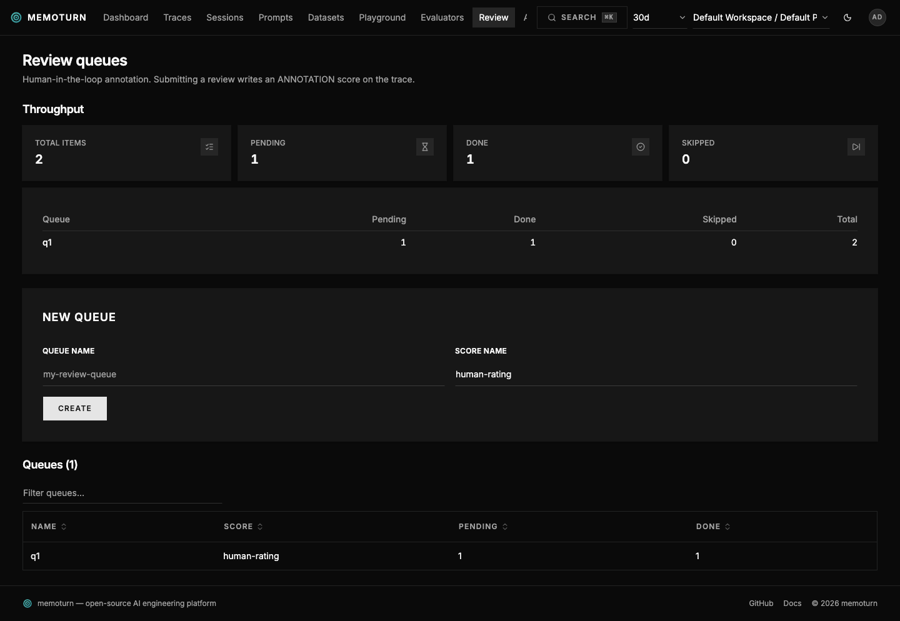
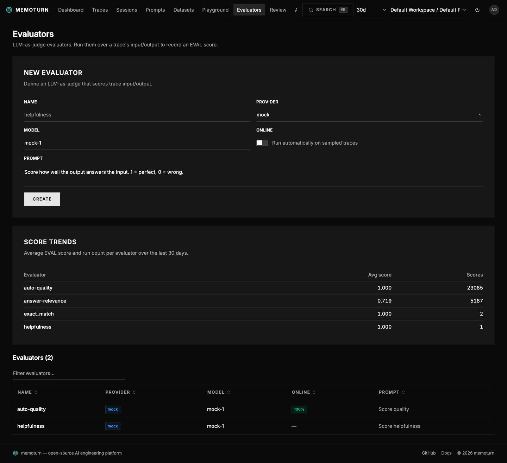

Memoturn supports three evaluation modes; all write **scores** into Doris, surfaced
on the trace alongside `API` feedback scores.

```
Offline:  Dataset + items ──► Experiment run ──► Evaluator ─────┐
Online:   Incoming trace ──► sampled? ──yes──► Evaluator ───────┼──► scores (Doris)
Human:    Review queue ──► Reviewer scores ─────────────────────┘            │
                                                                             ▼
                                                                    shown on the trace
```

| Mode | Source | How |
| --- | --- | --- |
| Offline | `EVAL` | Run an evaluator over a dataset/experiment |
| Online | `EVAL` | The worker samples production traces and scores them automatically |
| Human | `ANNOTATION` | Reviewers score traces in a review queue |

## Datasets & experiments (offline)

1. Create a dataset and add items (`input`, optional `expectedOutput`).
2. Run your task over each item, producing a trace per item.
3. Record a run linking items → traces (`POST /v1/datasets/{name}/runs`, or
   `dataset.recordRun()` in the SDK).
4. Score the traces (via an evaluator or human review).

See the dataset example in [TS SDK](/sdk-typescript/#datasets--experiments).

## Remote dataset runs

An in-platform experiment executes every dataset item through memoturn's provider gateway. That
is useless to a team whose eval harness already exists — their prompts, tools, and retrieval
live in their own service, and moving all of it here just to get a scored run isn't a trade
anyone should have to make.

Register a **runner** on the dataset instead:

```bash
# 1. Register your endpoint. The signing secret is returned ONCE.
curl -u pk-mt-dev:sk-mt-dev -X PUT http://localhost:3001/v1/datasets/regression/runner \
  -H 'content-type: application/json' -d '{"url":"https://your-harness.example/memoturn-runs"}'

# 2. Trigger a run (or click "Run remotely" on the dataset page).
curl -u pk-mt-dev:sk-mt-dev -X POST http://localhost:3001/v1/datasets/regression/remote-runs \
  -H 'content-type: application/json' -d '{"runName":"nightly-2026-08-12"}'
```

Your endpoint receives a signed POST:

```json
{ "event": "dataset.run.requested", "projectId": "…", "dataset": "regression",
  "runName": "nightly-2026-08-12", "version": null, "itemCount": 42,
  "itemsUrl": "/v1/datasets/regression", "resultsUrl": "/v1/dataset-run-items" }
```

The trigger is a **pointer, never a copy of the dataset**: it stays the same size whether the
dataset has 10 items or 100 000, and your runner pulls the items with its own API key — the
same documented endpoints a human would use. Verify authenticity exactly as for webhooks:
`HMAC_SHA256(secret, "<timestamp>.<body>")` against `X-Memoturn-Signature`, with the timestamp
in `X-Memoturn-Timestamp`.

Your harness then runs each item, sends traces through normal ingest, and links each result:

```bash
curl -u pk-mt-dev:sk-mt-dev -X POST http://localhost:3001/v1/dataset-run-items \
  -H 'content-type: application/json' \
  -d '{"datasetName":"regression","runName":"nightly-2026-08-12","datasetItemId":"…","traceId":"…"}'
```

From there the run is an ordinary run: it appears in the comparison matrix, evaluators can score
its traces, and `mt eval` can gate on it.

Two things worth knowing. The run row is created **before** the trigger is sent, so a run that
never reports back shows up empty rather than not at all — "their harness is slow" and "nothing
happened" look different. And the trigger response tells you whether the runner **accepted** the
request, not whether the run succeeded; the runner's last status and error are kept on the
dataset page.

## Evaluators

An evaluator is a judge prompt + provider/model. Providers: `mock` (deterministic, no key
— for local testing), `anthropic`, `openai`.

```bash
# create
curl -u pk-mt-dev:sk-mt-dev -X POST http://localhost:3001/v1/evaluators \
  -H 'content-type: application/json' \
  -d '{"name":"helpfulness","prompt":"Score how well output answers input (0..1).","provider":"mock","model":"mock-1"}'

# run over a trace's input/output → writes an EVAL score
curl -u pk-mt-dev:sk-mt-dev -X POST http://localhost:3001/v1/evaluators/helpfulness/run \
  -H 'content-type: application/json' \
  -d '{"traceId":"<id>","input":{"q":"…"},"output":"…"}'
```

The judge is asked to return strict JSON `{"score": 0..1, "reasoning": "…"}`.

The prebuilt library (`GET /v1/evaluators/templates`, instantiate via `POST
/v1/evaluators/from-template`) covers RAG/quality dimensions plus **conversation-quality**
metrics (user frustration, knowledge retention, session completeness, conversational
coherence) and **agent-trajectory** metrics (trajectory accuracy, tool correctness, task
completion).

## Code evaluators (deterministic checks)

Not every check deserves a model. "Is this valid JSON?", "does it match `^[A-Z]{3}-[0-9]{4}$`?",
"is it under 500 characters?" have exact answers, and asking an LLM for them is slow, costly, and
less reliable than the obvious computation.

A **code evaluator** (`kind: "CODE"`) is an expression instead of a judge prompt. It runs locally
— no provider call, no API key, no cost, and the same answer every time.

```bash
curl -u pk-mt-dev:sk-mt-dev -X POST http://localhost:3001/v1/evaluators \
  -H 'content-type: application/json' \
  -d '{"name":"json-contract","kind":"CODE","model":"n/a",
       "expression":"jsonValid(output) and jsonPath(jsonParse(output), \"$.status\") == \"ok\""}'
```

Everything else works identically to an LLM evaluator: online sampling, thread scope, dataset
experiments, guardrails, version history, and the EVAL score it writes.

### The expression language

Expressions are evaluated against four variables — `input`, `output`, `expected`, `metadata` —
and must return a **boolean** (pass/fail → 1/0) or a **number in [0, 1]** for a graded score.
Anything else is an error rather than a silently coerced score.

| | |
| --- | --- |
| **Operators** | `and` `or` `not` (also `&&` `\|\|` `!`), `==` `!=` `<` `<=` `>` `>=`, `+` `-` `*` `/` `%`, `a ? b : c` |
| **Access** | `output.field`, `output["field"]`, `output.items[0]`, `output.length` |
| **Strings** | `contains` `startsWith` `endsWith` `lower` `upper` `trim` `words` `matches` |
| **JSON** | `jsonValid` `jsonParse` `jsonPath` `has` `exactMatch` |
| **Numbers** | `num` `abs` `round` `min` `max` `len` `isEmpty` `coalesce` |

```
len(output) < 500
not contains(lower(output), "i cannot")
matches(output, "^[A-Z]{3}-[0-9]{4}$")
exactMatch(output, expected)
min(1, len(words(output)) / 50)          # a graded score, not just pass/fail
has(metadata, "score") and metadata.score > 0.5
```

`GET /v1/evaluators/presets` returns a library of ready-made checks (regex, JSON shape, length,
exact match, …) that the console offers as a menu; picking one fills in an editable expression.
`POST /v1/evaluators/test-expression` dry-runs an expression against a sample item — the console
uses it for the "Try it" panel, and it reports the raw value even when that value isn't a valid
score, which is exactly when you need to see it.

### Why an expression language and not "just run JavaScript"

Evaluators are user-authored config that executes inside the **shared ingest worker**, so the
language is safe by construction rather than by sandboxing:

- No `eval`, no `Function`, no host object graph, and no way to name anything not bound — there
  are no callable values, so `output.constructor()` is unparseable rather than merely blocked.
- Property reads are `hasOwn`-gated and `__proto__` / `constructor` / `prototype` are refused.
- `matches()` rejects patterns with nested repetition (the ReDoS signature) using the same static
  check the PII-masking policy uses, and caps subject length.
- Termination is structural — the language has no loops or recursion — with a node budget and a
  parser depth cap as backstops.
- It is dependency-free and portable: no `node:vm`, no WASM, so it behaves identically in the
  worker, the API, and a future edge profile (see [ADR-0003](/adr/0003-edge-deployment-profile/)).

Expressions are compiled at **write** time, so a broken check is a `400` when you save it rather
than a silent per-event failure in the worker later.

### LLM juries (ensemble judging)

Pass `jurors` — a list of `{provider, model}` — to turn an evaluator into an ensemble. The
same judge prompt runs against every juror and the score is the **mean** of their votes
(a juror that errors is dropped; the panel only fails if all jurors do). This reduces
single-judge variance:

```json
{ "name": "quality", "prompt": "…", "model": "mock-1",
  "jurors": [{ "provider": "openai", "model": "gpt-x" }, { "provider": "anthropic", "model": "claude-y" }] }
```

### Online evaluation

Enable `online` with a `samplingRate` (and optional `filterName`). After each ingest
batch, the worker runs enabled online evaluators on the batch's **completed** traces
(those carrying an output), deterministically sampled by `hash(traceId:evaluator)`:

```json
{ "name": "auto-quality", "prompt": "…", "provider": "mock", "model": "mock-1",
  "online": true, "samplingRate": 1.0, "filterName": "" }
```

### Thread (conversation) evaluation

Set `scope: "thread"` (with `online: true`) to score whole conversations instead of single
traces. A per-minute worker cron finds sessions that have been quiet for `cooldownSeconds`
(default 900), assembles the session transcript, judges it, and writes one score to the
session's latest trace — so multi-turn conversations "settle" before being judged:

```json
{ "name": "user-frustration", "prompt": "…", "provider": "mock", "model": "mock-1",
  "online": true, "scope": "thread", "cooldownSeconds": 900 }
```

### What a judge emits

By default a judge is asked for `{"score": 0..1, "reasoning": "…"}`, and the result is recorded
as a NUMERIC score. Plenty of judgements aren't a number, so an evaluator can declare what it
produces:

| `scoreDataType` | The judge is asked for | Recorded as |
| --- | --- | --- |
| `NUMERIC` (default) | `{"score": 0..1, "reasoning"}` | numeric `value` |
| `CATEGORICAL` | `{"label": "…", "reasoning"}` | `stringValue`, **no** numeric value |
| `BOOLEAN` | `{"pass": true/false, "reasoning"}` | `value` 1 or 0 |

```json
{ "name": "failure-mode", "prompt": "Classify the failure, if any.",
  "scoreDataType": "CATEGORICAL", "scoreCategories": ["hallucination", "refusal", "wrong-tool", "ok"] }
```

`scoreCategories` is a contract, not a hint: a judge that answers off-list has its label
rejected (and the attempt recorded in the reasoning) rather than silently creating a new
category, which would fragment the score's own distribution. Leave it empty to accept anything.

`scoreName` records the score under a different name than the evaluator — use it when two
evaluators should write the same score, e.g. a v2 judge replacing a v1 so their values stay
comparable on one timeline.

Two consequences worth knowing:

- A categorical score has **no numeric value at all** — not a zero. It never drags an average
  down, and it can't back an evaluator **guardrail** (which is a numeric threshold); a guard
  pointed at a categorical evaluator is skipped and logged rather than compared against a
  stand-in zero. Compare labels on the Scores page instead.
- An **LLM jury** aggregates labels by **majority vote**, not by mean.

### Observation (span) evaluation

Set `scope: "observation"` to score individual **spans** instead of whole runs — one score per
span, attached to the observation. `filterName` then matches the SPAN name, so a judge can
target exactly the step you care about:

```json
{ "name": "context-relevance", "prompt": "…", "provider": "mock", "model": "mock-1",
  "online": true, "scope": "observation", "filterName": "retriever" }
```

### Variable mapping

By default a judge sees the trace's `input`, `output`, and `expectedOutput`. That makes some
judges impossible to express: "is the retrieved context relevant to the question?" needs the
*retriever span's* output, not the final answer. `variableMapping` binds each variable the
prompt references to a chosen source:

```json
{ "name": "context-relevance",
  "prompt": "Does the context {{context}} support answering {{question}}? Score 0..1.",
  "variableMapping": [
    { "variable": "question", "source": "trace.input", "jsonPath": "q" },
    { "variable": "context",  "source": "observation.output", "observationName": "retriever" }
  ] }
```

Sources are `trace.input|output|metadata`, `observation.input|output|metadata` (with
`observationName` selecting the span), and `dataset.input|expectedOutput|metadata` (experiment
runs). `jsonPath` is an optional dotted path into the selected value (`docs.0.text`). The judge
receives exactly the mapped variables as its payload, and `{{name}}` references in the prompt
are substituted. An unresolvable binding becomes `null` rather than failing the run, and an
empty mapping keeps the built-in binding — so existing evaluators are unaffected.

Code evaluators get the mapped variables as **additional** bindings alongside `input`,
`output`, `expected`, and `metadata`, so an existing expression keeps working.

### Backfill (scoring existing traces)

Online evaluation only ever sees new traffic, so a judge published today has nothing to say
about yesterday. A backfill runs an evaluator over traces you have **already ingested**,
targeted with the same window + structured filter set the traces list uses:

```bash
# how many traces would this score?
curl -u pk-mt-dev:sk-mt-dev 'http://localhost:3001/v1/evaluators/backfills/preview?days=7'

# queue it (returns immediately; poll GET /v1/evaluators/backfills for progress)
curl -u pk-mt-dev:sk-mt-dev -X POST http://localhost:3001/v1/evaluators/helpfulness/backfill \
  -H 'content-type: application/json' -d '{"days":7}'
```

The run executes on the worker (each trace is a judge call), reports `processed`/`failed`
counters as it goes, and is capped at 5000 traces per run — the cap is recorded on the run,
never applied silently. Score ids are deterministic in (target, evaluator), so re-running
overwrites instead of duplicating. Thread-scope evaluators can't be backfilled: they are driven
by session settling, not by a trace selection.

### CI gates (`mt eval`)

`mt eval` (shipped with the JS SDK) gates a dataset run's evaluator score means against
thresholds and exits non-zero on a regression — drop it into CI to fail a PR on eval drift.
See the TypeScript SDK docs and `POST /v1/datasets/{name}/runs/{run}/gate`.

## Score analytics

The **Scores** page answers "is this score trustworthy?".

One score at a time: summary statistics (count, mean, median, standard deviation), the shape of
its values (a 10-bucket histogram for numeric scores, label counts for categorical ones), and a
daily timeline — where a step usually means a config change rather than model drift.

Two scores at a time is the more valuable half: pick a second score and the page compares the two
**sources** over the traces that carry both. That is how a team proves a judge is trustworthy —
human vs judge, judge vs judge, or v1 vs v2 of the same judge:

- **Numeric pairs** → Pearson correlation (do they rank traces the same way?), MAE and RMSE (how
  far apart are they in absolute terms?).
- **Label pairs** → agreement rate, **Cohen's Kappa** (agreement corrected for chance — two
  raters who always say "pass" agree 100% of the time and score 0), and per-label F1.
- Both → a **confusion matrix**; the diagonal is agreement and everything off it is where the
  two sources part ways. Numeric values are bucketed first.

The pair join is the widest query in the product, so it scans at most 20 000 pairs; past that the
statistics are computed over a sample and the result says so rather than presenting a partial
number as a total.

## Human review queues

```bash
# create a queue + enqueue traces
curl -u pk-mt-dev:sk-mt-dev -X POST http://localhost:3001/v1/review-queues \
  -H 'content-type: application/json' -d '{"name":"q1","scoreName":"human-rating","dataType":"NUMERIC"}'
curl -u pk-mt-dev:sk-mt-dev -X POST http://localhost:3001/v1/review-queues/q1/items \
  -H 'content-type: application/json' -d '{"traceIds":["<id>"]}'

# reviewer submits a score (writes an ANNOTATION score, marks item done)
curl -u pk-mt-dev:sk-mt-dev -X POST http://localhost:3001/v1/review-queues/q1/items/<itemId>/score \
  -H 'content-type: application/json' -d '{"value":0.8,"comment":"looks good"}'
```

The console **Review** page shows each pending item's trace input/output with an inline
scoring form.



Evaluator runs and their scores are visible on the **Evaluators** page:


