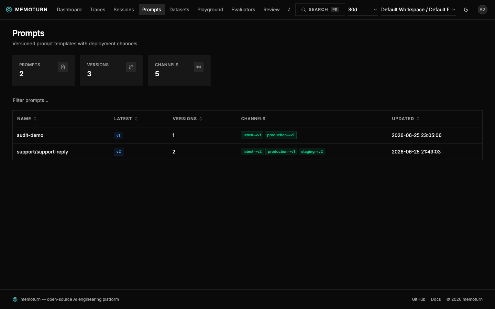
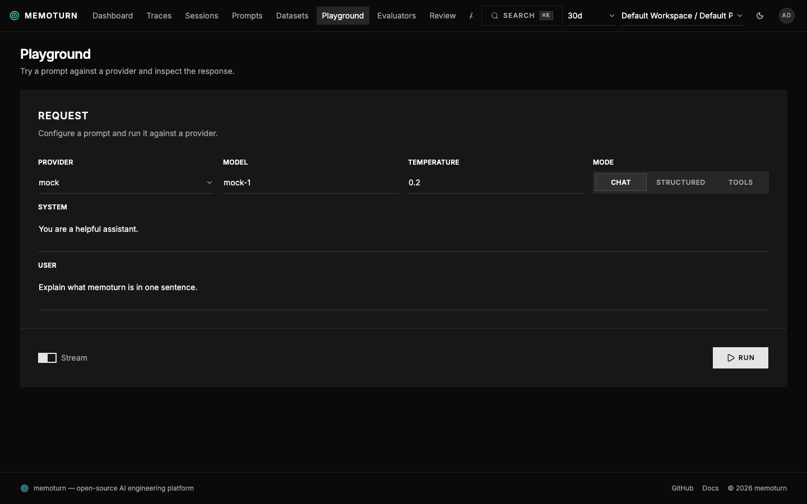

A versioned prompt registry with deployment **channels**.

- **Versions** are immutable — every save creates the next version.
- **Channels** are movable pointers. `latest` always tracks the newest version; you also
  deploy to `production` or custom labels. SDKs fetch by channel and cache nothing they
  shouldn't (resolution is a simple authenticated GET).

## Create / update a version

```bash
curl -u pk-mt-dev:sk-mt-dev -X POST http://localhost:3001/v1/prompts \
  -H 'content-type: application/json' \
  -d '{
        "name": "support-reply",
        "type": "CHAT",
        "content": [
          {"role":"system","content":"You are a concise agent for {{product}}."},
          {"role":"user","content":"{{question}}"}
        ],
        "config": {"model":"claude-sonnet-4-6","temperature":0.2},
        "labels": ["production"]
      }'
```

`labels` point those channels at the new version; `latest` is always updated.

## Resolve & compile (SDK)

```ts
const prompt = await getPrompt(creds, "support-reply", { channel: "production" });
const messages = compilePrompt(prompt, { product: "memoturn", question: q });
```

`compilePrompt` / `compile_prompt` substitute `{{variable}}` placeholders in both TEXT
(string) and CHAT (message list) prompts.

## In the console

The **Prompts** page lists prompts with their channels and latest version; the detail
view shows every version, which channels point at it, and the content + config.



Iterate on a prompt in the **Playground** before promoting it — every run is recorded as a trace:



See the API: [`/v1/prompts`](/api/#prompts).
