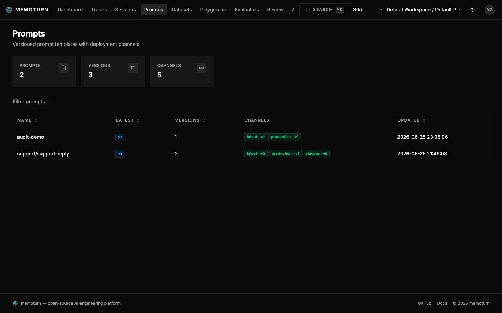
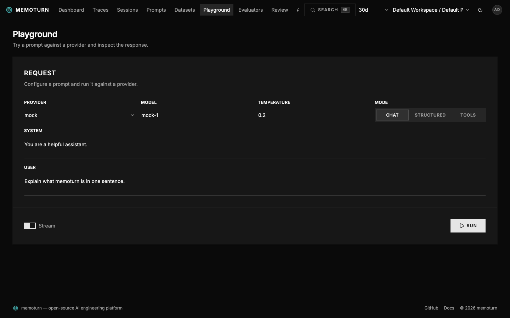

A versioned prompt registry with deployment **channels**.

- **Versions** are immutable — every save creates the next version.
- **Channels** are movable pointers. `latest` always tracks the newest version; you also
  deploy to `production` or custom labels. SDKs fetch by channel and cache nothing they
  shouldn't (resolution is a simple authenticated GET).

## Create / update a version

```bash
curl -u pk-mt-dev:sk-mt-dev -X POST http://localhost:3001/v1/prompts \
  -H 'content-type: application/json' \
  -d '{
        "name": "support-reply",
        "type": "CHAT",
        "content": [
          {"role":"system","content":"You are a concise agent for {{product}}."},
          {"role":"user","content":"{{question}}"}
        ],
        "config": {"model":"claude-sonnet-4-6","temperature":0.2},
        "labels": ["production"]
      }'
```

`labels` point those channels at the new version; `latest` is always updated.

## Resolve & compile (SDK)

```ts
const prompt = await getPrompt(creds, "support-reply", { channel: "production" });
const messages = compilePrompt(prompt, { product: "memoturn", question: q });
```

`compilePrompt` / `compile_prompt` substitute `{{variable}}` placeholders in both TEXT
(string) and CHAT (message list) prompts.

## Composing prompts

A prompt embeds another by reference, so a shared preamble lives in one place instead of being
copy-pasted into a dozen prompts (where it drifts) or concatenated in application code (where
the registry can't see it):

```text
@@@memoturnPrompt:name=safety-preamble|label=production@@@

Answer the user's question about {{product}}.
```

Use `|label=X` to follow a channel (updating the shared prompt updates everything that includes
it — that's the point) or `|version=3` to pin. References are expanded **server-side at resolve
time**, so every SDK gets composition without an upgrade, and the raw body with its references
intact is still what the detail endpoint and the console editor show.

Guardrails, all enforced at save time so a broken prompt is a `400` you see immediately rather
than a failure in someone's request path:

- **Cycles are refused** — direct (`a` includes `a`) or indirect (`a → b → c → a`), with the
  path named in the error.
- Nesting deeper than 5 is refused, even when nothing repeats.
- A referenced prompt must be **TEXT**: its body is spliced into a string, and a message array
  has no meaningful rendering there. This one is checked at resolve time too, since the target
  can be retyped after the referring prompt was written.

Cycle detection at save time accounts for the channels the new version is about to occupy, so
saving `a → b` when `b → a` already exists is refused even though `a`'s *current* body is
innocent. Resolution keeps its own check anyway: if a reference breaks later — the target is
renamed, retyped, or deleted — resolving returns **422** naming the full path, because the
prompt exists but can't be assembled.

## Chat placeholders

A `{{variable}}` substitutes one string. Chat history and retrieved few-shot examples are a
**list of messages with roles**, which no variable can express — so a CHAT prompt can reserve a
slot instead:

```json
[
  { "role": "system", "content": "You are a support agent." },
  { "type": "placeholder", "name": "history" },
  { "role": "user", "content": "{{question}}" }
]
```

Fill it (and any variables) in one call:

```bash
curl -u pk-mt-dev:sk-mt-dev -X POST http://localhost:3001/v1/prompts/support-reply/compile \
  -H 'content-type: application/json' \
  -d '{"variables":{"question":"where is my order?"},
       "placeholders":{"history":[{"role":"user","content":"hi"},{"role":"assistant","content":"hello"}]}}'
```

Doing this server-side means every language gets placeholders today, without waiting on three
SDK releases. An **unfilled slot is dropped**, not left in the output: a history slot on the
first turn has nothing to put there, and shipping a literal `{"type":"placeholder"}` to a
provider would fail at the worst moment. An unknown `{{variable}}` is left as written, so it's
visible in the output rather than silently becoming an empty string.

`GET /v1/prompts/{name}` also reports the slot names it still expects, in `placeholders`.

## In the console

The **Prompts** page lists prompts with their channels and latest version; the detail
view shows every version, which channels point at it, and the content + config.



Iterate on a prompt in the **Playground** before promoting it — every run is recorded as a trace:



See the API: [`/v1/prompts`](/api/#prompts).
