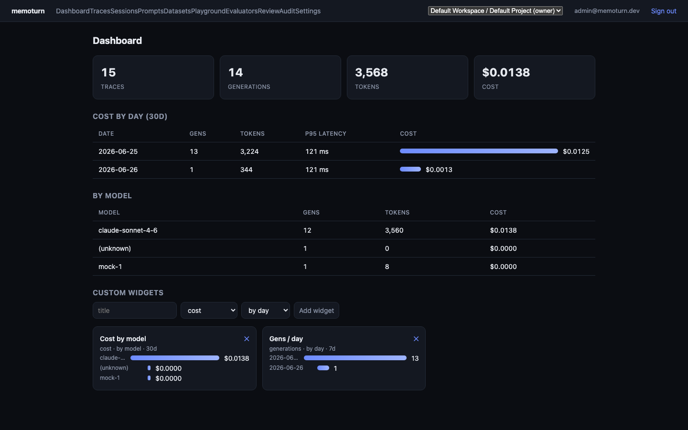
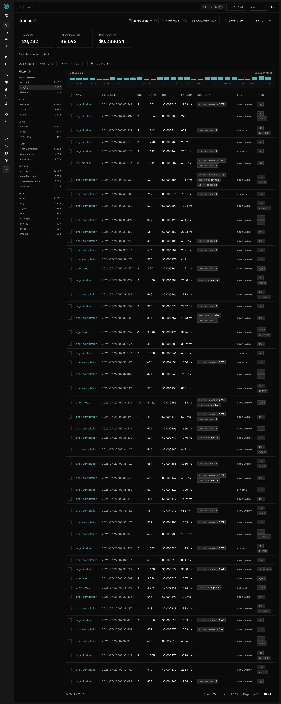
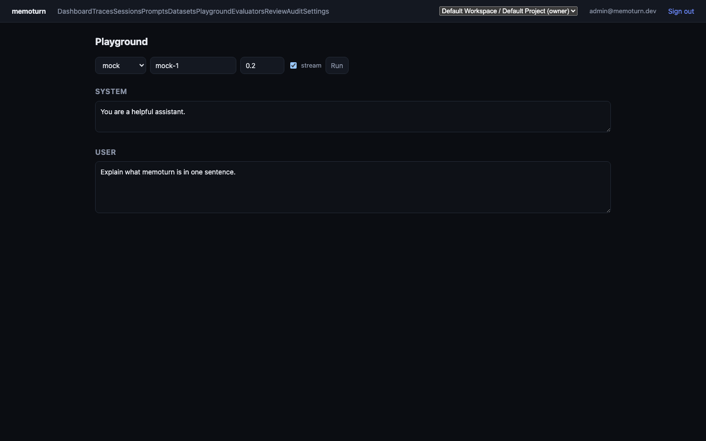

# memoturn documentation

memoturn is an open-source AI engineering platform: LLM observability, evals, metrics,
prompt management, playground, and datasets. Self-hostable, OpenTelemetry-native, and
Bun-native.

## Contents

- [Getting started](./getting-started.md) — install, run, emit your first trace
- [Architecture](./architecture.md) — services, data flow, storage tiers
- [Concepts](./concepts.md) — traces, observations, scores, sessions, prompts, datasets, evaluators
- [Configuration](./configuration.md) — environment variables
- [REST API](./api.md) — the `/v1` surface, auth, OpenAPI
- [TypeScript SDK](./sdk-typescript.md)
- [Python SDK](./sdk-python.md)
- [Integrations](./integrations.md) — OpenTelemetry, OpenAI, LangChain, LiteLLM
- [Prompt management](./prompts.md)
- [Evaluation](./evaluation.md) — offline, online, and human review
- [Deployment](./deployment.md) — Docker, scaling, retention
- [Roadmap](./roadmap.md) — shipped + prioritized backlog

## Screenshots

| Dashboard | Traces |
| --- | --- |
|  |  |

| Trace waterfall | Playground |
| --- | --- |
|  |  |

More: [evaluators](./images/evaluators.png) · [review queues](./images/review.png) ·
[prompts](./images/prompts.png) · [datasets](./images/datasets.png) ·
[sessions](./images/sessions.png) · [settings](./images/settings.png). Regenerate with
`bun run screenshots` (requires `bun run dev` + seeded data).

## At a glance

| Capability | Where |
| --- | --- |
| Tracing / observability + waterfall timeline | [concepts](./concepts.md), [integrations](./integrations.md) |
| Metrics & dashboards (cost / tokens / latency) | [concepts](./concepts.md) |
| Prompt registry + deployment channels | [prompts](./prompts.md) |
| Playground (multi-provider, streaming) | [api](./api.md#playground) |
| Datasets & experiments | [evaluation](./evaluation.md) |
| Evaluators (LLM-as-judge, offline + online) | [evaluation](./evaluation.md) |
| Human annotation / review queues | [evaluation](./evaluation.md) |
| Auth, projects, RBAC, audit logs, retention | [deployment](./deployment.md), [api](./api.md) |
| SDKs (TypeScript + Python) | [TS](./sdk-typescript.md), [Py](./sdk-python.md) |
