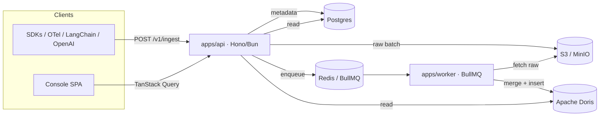
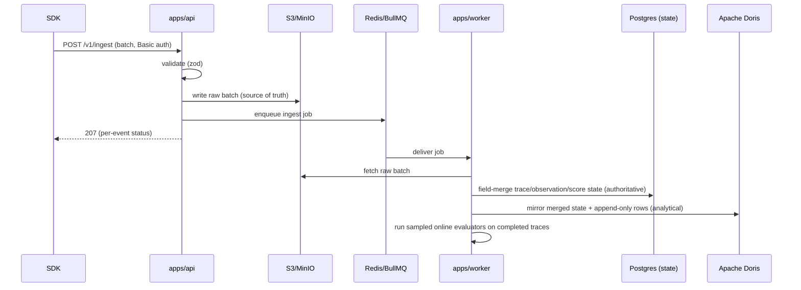

# Architecture

memoturn is an async, decoupled, Bun-native system. Ingestion is fire-and-forget: the
API persists raw events and acks immediately; a worker does the heavy writes.

## Services

| Service | Tech | Responsibility |
| --- | --- | --- |
| `apps/api` | Hono on Bun | Public `/v1` REST, OTel receiver, Better Auth, OpenAPI/Scalar |
| `apps/console` | Vite + TanStack Router SPA | Dashboard (talks to the API via TanStack Query) |
| `apps/worker` | Bun + BullMQ | Async ingest → Doris, online evaluators, retention cron |

## Storage tiers

| Store | Tech | Holds |
| --- | --- | --- |
| OLTP | PostgreSQL (Prisma 7, pg driver adapter) | Workspaces, projects, users/sessions, API keys, prompts, datasets, evaluators, review queues, provider connections (encrypted), audit log, retention policies |
| OLAP | Apache Doris | `traces`, `observations`, `scores` (`UNIQUE KEY` merge-on-write tables); dashboard metrics are aggregated on the fly from `observations` |
| Queue / cache | Redis (Valkey) + BullMQ | Async ingest queue, API-key cache, retention cron |
| Blob | S3-compatible (MinIO locally) | Raw replayable event log, exports |

## Ingestion pipeline

- The API acks fast; the blob event log is the source of truth, so both stores below are
  rebuildable.
- Merge semantics (ADR-0001): mutable entities (trace/observation/score) are **authoritative in
  Postgres** — each ingest event merges field-by-field into a `*State` row (an atomic
  `INSERT … ON CONFLICT DO UPDATE SET col = COALESCE(EXCLUDED.col, stored.col)`), so a partial
  update keeps the fields it omits and concurrent batches can't lose each other's fields. **Doris is
  the analytical mirror**: the worker writes each Doris row FROM the merged Postgres state (computing
  derived latency/cost), ordered by `stateVersion` (its merge-on-write sequence). Append-only rows
  (retrieval documents, embeddings) come straight from the events. There is no Doris read-merge.

## Packages

| Package | Purpose |
| --- | --- |
| `packages/core` | Zod **ingest** event contracts (SDK ↔ API ↔ worker), model/cost registry |
| `packages/contracts` | Zod **API response** schemas + inferred types (API doc + console types) |
| `packages/db` | Prisma client + blob / queue clients |
| `packages/telemetry` | `TelemetryStore` interface + Apache Doris implementation (all telemetry SQL) |
| `packages/server` | Shared server logic: auth, traces, metrics, prompts, datasets, evaluators, review, export, retention, Better Auth |
| `packages/llm` | Provider gateway (mock / Anthropic / OpenAI via the AI SDK) + API-key encryption |
| `sdks/js`, `sdks/python` | Client SDKs |

## Type-safety model

- **Ingest contracts** (`packages/core`) are the single source of truth for the
  SDK → API → worker wire format.
- **Response contracts** (`packages/contracts`) are zod schemas used by the API's
  OpenAPI responses *and* inferred into TypeScript types consumed by both the server
  (return types) and the console (client types). A drift between what the server returns
  and the contract is a compile error.

## Auth model

- **API keys** (Basic auth, `pk-mt-…` / `sk-mt-…`) — for SDKs and programmatic access;
  scoped to one project, hashed in Postgres, cached in Redis.
- **Better Auth session** (cookie) — for the dashboard; resolves the user's role and
  active project (via the `x-memoturn-project` header / project switcher).

See [Concepts](./concepts.md) for the data model and [Deployment](./deployment.md) for
scaling.
