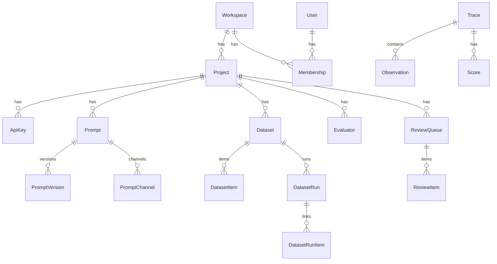

# Concepts

## Data model

Relational metadata (workspaces, projects, prompts, datasets, …) lives in **Postgres**;
high-volume **Trace / Observation / Score** telemetry lives in **ClickHouse** and is
linked by `trace_id` / `project_id`.

## Tenancy

- **Workspace** → **Project**. All telemetry and config is scoped to a project.
- **Membership** binds a user to a workspace with a **role**: `OWNER`, `ADMIN`,
  `MEMBER`, `VIEWER`. Viewers are read-only.
- **API keys** are per-project (`pk-mt-…` public, `sk-mt-…` secret).

## Observability

- **Trace** — one logical request/run. Has a name, optional `userId`, `sessionId`,
  `release`, `version`, `environment`, tags, metadata, input, output.
- **Observation** — a step inside a trace. Three kinds:
  - **span** — generic unit of work
  - **generation** — an LLM call (model, provider, token usage, cost, latency)
  - **event** — a point-in-time marker
  Observations nest via `parentObservationId`, rendered as a **waterfall timeline**.
- **Score** — a numeric/categorical/boolean measurement attached to a trace (or
  observation). `source` is one of:
  - `API` — sent via SDK/API (e.g. user feedback)
  - `EVAL` — produced by an evaluator (LLM-as-judge)
  - `ANNOTATION` — produced by a human review
- **Session** — traces sharing a `sessionId` (a conversation/thread). Sessions roll up
  trace counts and cost.
- **Environment** — free-form label (e.g. `production`, `staging`, `playground`) for
  separating and filtering telemetry.

Cost is computed by the worker from the model + token usage using the registry in
`packages/core` (extend `MODEL_PRICES` to add models).

## Metrics

Generations are rolled up daily (per project, environment, model) into cost, tokens,
counts, and latency quantiles (p50/p95/p99) via a ClickHouse materialized view. The
dashboard and `GET /v1/metrics` read from this rollup.

## Prompt management

- **Prompt** — named, optionally foldered. **Versions** are immutable; each save creates
  a new version.
- **Channel** — a movable deployment pointer (e.g. `production`, `latest`, or custom).
  `latest` always tracks the newest version. SDKs fetch by channel.

See [Prompts](./prompts.md).

## Datasets & experiments

- **Dataset** — a set of **items** (`input`, optional `expectedOutput`, metadata).
- **Run** (experiment) — links each dataset item to the trace produced by running a task
  on it; scores on those traces are the experiment's results.

## Evaluators

LLM-as-judge **evaluators** (judge prompt + provider/model) score traces and write an
`EVAL` score. They run two ways:

- **Offline** — over a dataset/experiment.
- **Online** — the worker samples incoming production traces and scores them
  automatically (per-evaluator sampling rate + optional trace-name filter).

## Review queues

Human-in-the-loop annotation. A **review queue** holds traces to score manually;
submitting a review writes an `ANNOTATION` score and marks the item done.

See [Evaluation](./evaluation.md) for all three modes.

## Audit log & retention

- **Audit log** — records who did what (prompt/dataset/provider/evaluator/review/retention
  mutations) per project.
- **Retention policy** — optional per-project max age; a daily worker job deletes
  telemetry older than the policy (0 = keep forever).
