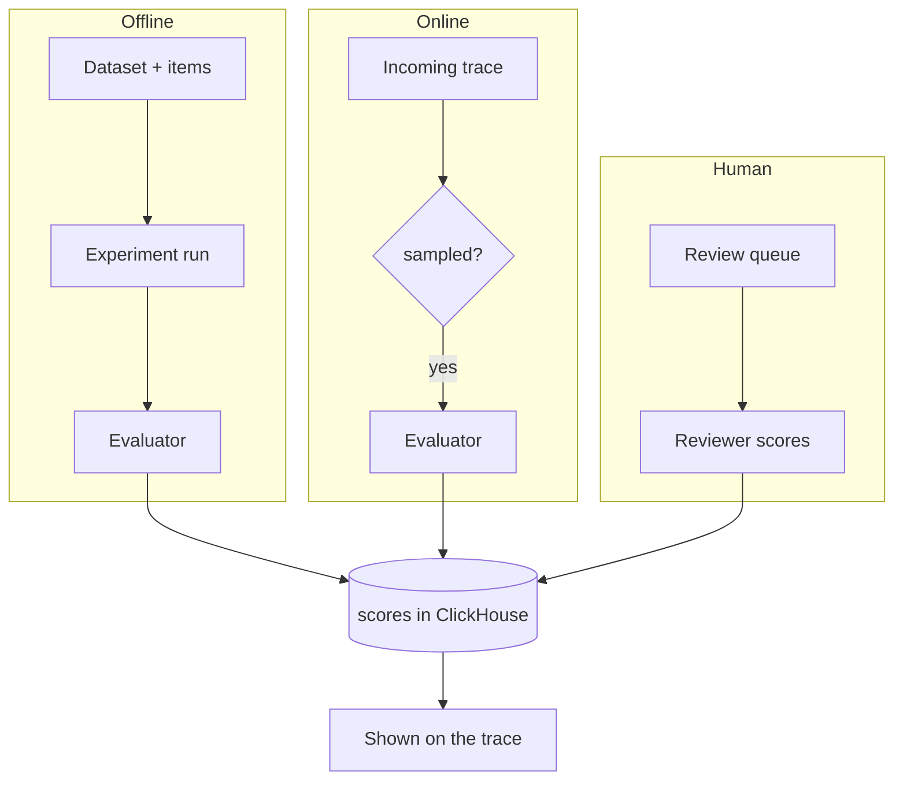

# Evaluation

memoturn supports three evaluation modes; all write **scores** into ClickHouse, surfaced
on the trace alongside `API` feedback scores.



| Mode | Source | How |
| --- | --- | --- |
| Offline | `EVAL` | Run an evaluator over a dataset/experiment |
| Online | `EVAL` | The worker samples production traces and scores them automatically |
| Human | `ANNOTATION` | Reviewers score traces in a review queue |

## Datasets & experiments (offline)

1. Create a dataset and add items (`input`, optional `expectedOutput`).
2. Run your task over each item, producing a trace per item.
3. Record a run linking items → traces (`POST /v1/datasets/{name}/runs`, or
   `dataset.recordRun()` in the SDK).
4. Score the traces (via an evaluator or human review).

See the dataset example in [TS SDK](./sdk-typescript.md#datasets--experiments).

## Evaluators (LLM-as-judge)

An evaluator is a judge prompt + provider/model. Providers: `mock` (deterministic, no key
— for local testing), `anthropic`, `openai`.

```bash
# create
curl -u pk-mt-dev:sk-mt-dev -X POST http://localhost:3001/v1/evaluators \
  -H 'content-type: application/json' \
  -d '{"name":"helpfulness","prompt":"Score how well output answers input (0..1).","provider":"mock","model":"mock-1"}'

# run over a trace's input/output → writes an EVAL score
curl -u pk-mt-dev:sk-mt-dev -X POST http://localhost:3001/v1/evaluators/helpfulness/run \
  -H 'content-type: application/json' \
  -d '{"traceId":"<id>","input":{"q":"…"},"output":"…"}'
```

The judge is asked to return strict JSON `{"score": 0..1, "reasoning": "…"}`.

### Online evaluation

Enable `online` with a `samplingRate` (and optional `filterName`). After each ingest
batch, the worker runs enabled online evaluators on the batch's **completed** traces
(those carrying an output), deterministically sampled by `hash(traceId:evaluator)`:

```json
{ "name": "auto-quality", "prompt": "…", "provider": "mock", "model": "mock-1",
  "online": true, "samplingRate": 1.0, "filterName": "" }
```

## Human review queues

```bash
# create a queue + enqueue traces
curl -u pk-mt-dev:sk-mt-dev -X POST http://localhost:3001/v1/review-queues \
  -H 'content-type: application/json' -d '{"name":"q1","scoreName":"human-rating","dataType":"NUMERIC"}'
curl -u pk-mt-dev:sk-mt-dev -X POST http://localhost:3001/v1/review-queues/q1/items \
  -H 'content-type: application/json' -d '{"traceIds":["<id>"]}'

# reviewer submits a score (writes an ANNOTATION score, marks item done)
curl -u pk-mt-dev:sk-mt-dev -X POST http://localhost:3001/v1/review-queues/q1/items/<itemId>/score \
  -H 'content-type: application/json' -d '{"value":0.8,"comment":"looks good"}'
```

The console **Review** page shows each pending item's trace input/output with an inline
scoring form.
